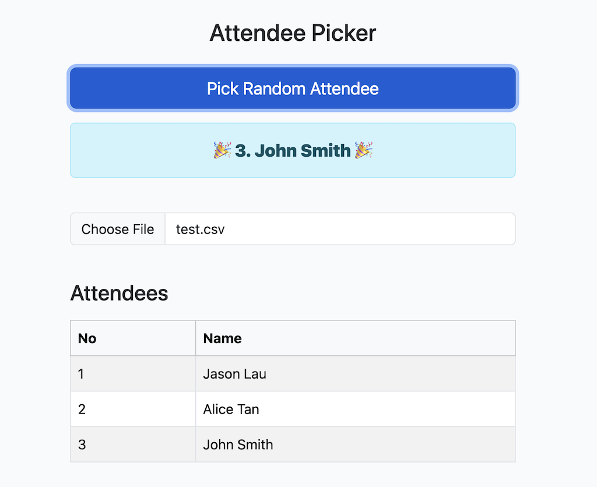
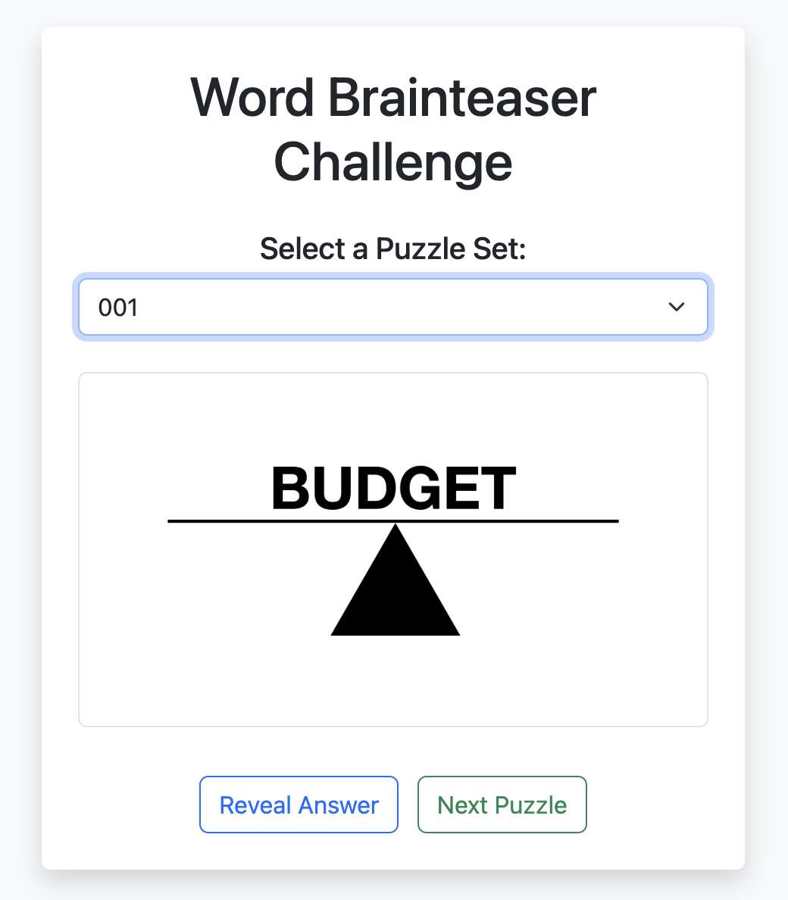
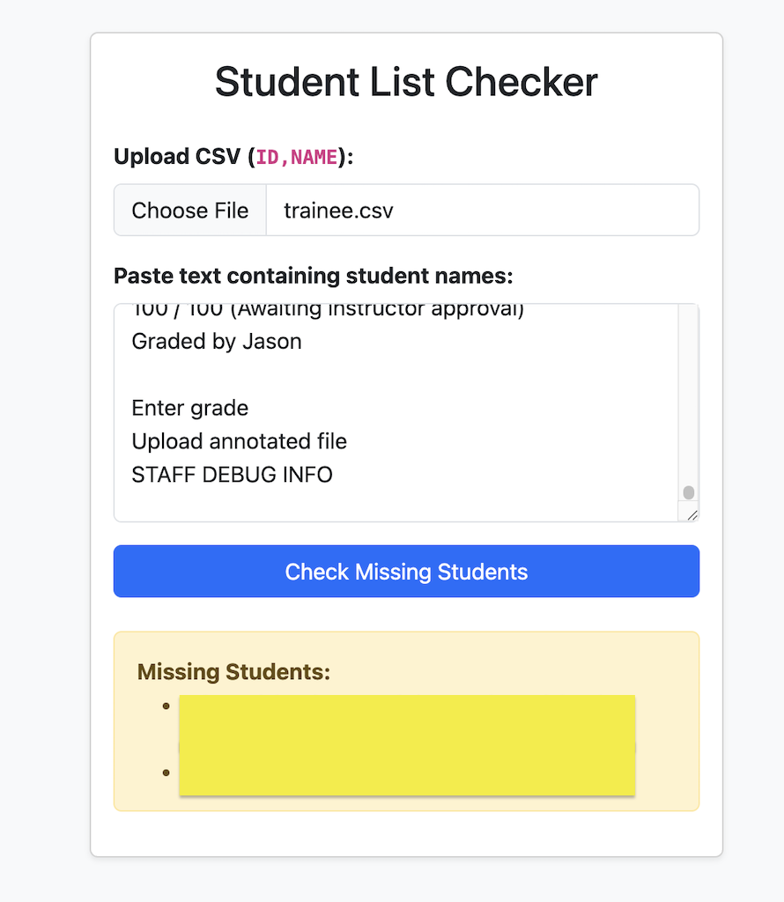
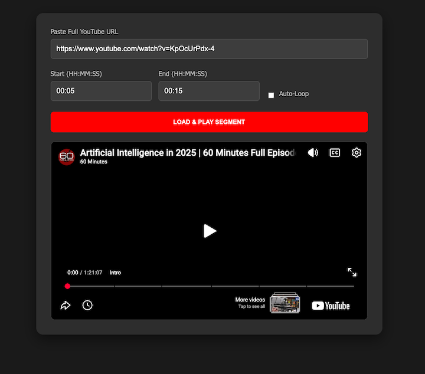

# TeachingTools
Tools for online teaching

> In case you have security or privacy concerns, rest assured:
> - tools 
>   - runs ONLY on your local browser 
>   - do NOT 
>       - store the files uploaded to any backend
>       - track or upload any personal details 

## IceBreaker Introduction App 
Intent is for 
- Instructor to get each of trainee to introduce themselves 
- Instructor types in (on own browser)
    - web app renders graphically on network graph 


### Usage
- open [intro_app.html](https://jasonl888.github.io/TeachingTools/intro_app/intro.html) in browser
- type in name, work, interest
    - tool renders in bubble node links
- click export to save as JSON
    - in future, can import to continue

## Randomizer
Intent is for 
- Instructor to randomly pick a trainee for response 



### Usage
- open [randomizer.html](https://jasonl888.github.io/TeachingTools/randomizer/randomizer.html) in browser
- upload a csv of attendees
    - click on "Choose File"
    - sample format
    ```csv
    No, Name
    1, Jason Lau
    2, Alice Tan
    3, John Smith
    ```
- click on "Pick Random Attendee"

## Word Brain Teasers
Intent is for Instructor to flash on screen and ask students to type in chat their guess



> Credit: https://kids.niehs.nih.gov/games/brainteasers/word-brainteasers

### Usage
- open [word_brainteasers](https://jasonl888.github.io/TeachingTools/word_brainteasers/index.html) in browser
- select folder
- click on reveal or next

## Student List Checker
Intent is for Instructor to identify which student has not marked attendance or submitted assessment (some LMS just don't provide that feature ... sigh)



### Usage
- open [student checker](https://jasonl888.github.io/TeachingTools/list_checker/index.html)
- click to upload list of trainees in CSV (ID, NAME)
- post the contents from LMS (with list of students that submitted assignment)
    - Note: the names have to match for proper identification


## Youtube Video Segment Watcher
Intent is for instructor to share video with students in class



### Usage
- open [video segment watcher](https://jasonl888.github.io/TeachingTools/youtube_segment_viewer/index.html) in browser
- enter the start and end times

# Misc
## Testing on Local Machine
- go to the folder
- start up http server
```bash
python3 -m http.server 8000
```
- access on browser 

