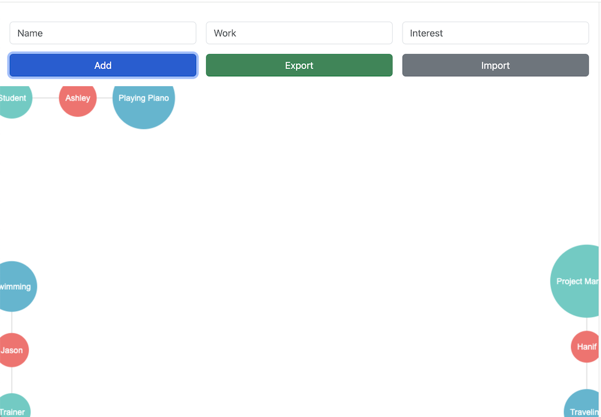

# TeachingTools
Tools for online teaching

## IceBreaker Introduction App 
Intent is for Instrutor to get each of trainee to introduce themselves and user the app to show

### Usage
- open [intro_app.html](https://jasonl888.github.io/TeachingTools/intro_app/intro.html) in browser
- type in name, work, interest
    - tool renders in bubble node links
- click export to save as JSON
    - in future, can import to continue

